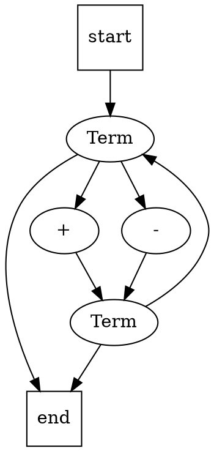

# Original syntax diagram from article
This diagram is for a parser that only understands addition and substraction. 

```dot
digraph G {
    start [shape="square"];
    end [shape="square"];
    term1 [label="Term"];
    term2 [label="Term"];
    plus  [label="+"];
    minus [label="-"];

    start -> term1;
    term1 -> plus;
    term1 -> minus;
    plus -> term2;
    minus -> term2;
    term2 -> term1;
    term2 -> end;
    term1 -> end;
}
```
For multiplication / division the graph is essentially the same: 

```dot
digraph G {
    start [shape="square"];
    end [shape="square"];
    term1 [label="Term"];
    term2 [label="Term"];
    plus  [label="*"];
    minus [label="/"];

    start -> term1;
    term1 -> plus;
    term1 -> minus;
    plus -> term2;
    minus -> term2;
    term2 -> term1;
    term2 -> end;
    term1 -> end;
}
```
